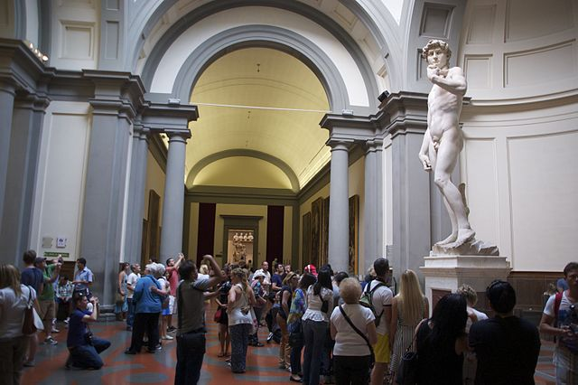
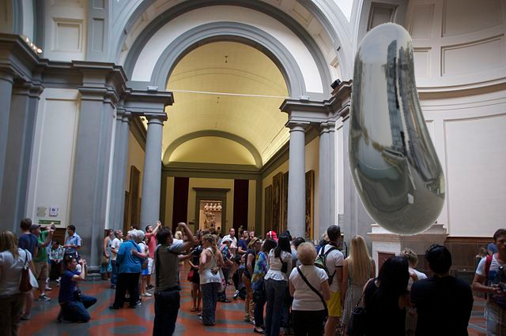

# Bean There, Done That

Chicago's status as a world-class city is cemented by its iconic bean sculpture. Other cities, wanting to replicate the success, have muddied the bean waters by introducing their own bean variations: New York City has a bean sharing similar properties, and Ottawa has a sphere, dubbed the ``Ottawa bean'' by locals. Our economic analysis proves their worth, so naturally other cities will want their own. We present a mathematical model of the space of all bean sculptures, and an algorithm to help cities replace existing landmarks with beans.

<table>
<tr>
<td>

</td>
<td>

</td>
</tr>
</table>

Paper: https://davepagurek.github.io/bean-there-done-that/beans.pdf

Try your own bean: https://openprocessing.org/sketch/2181338

Talk: https://www.youtube.com/watch?v=Su300wJxmF4

Slides: https://davepagurek.github.io/bean-there-done-that/slides
